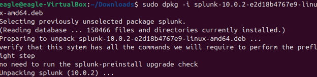

**Introduction**

In today’s cybersecurity environment, the Security Operations Center (SOC) has moved beyond its original reactive role, where security alerts were investigated only after an incident had occurred. Earlier SOC models depended largely on signature-based detection techniques. From my perspective, modern SOC operations now emphasize proactive threat hunting, working on the assumption that an attacker may already be present within the network and therefore requiring continuous and systematic investigation. Security Information and Event Management (SIEM) solutions remain a core component of this transformation, with tools such as Splunk aggregating large volumes of data from multiple sources to deliver real-time situational awareness. In this report, I apply Search Processing Language (SPL) to examine and correlate data from the Botsv3 dataset, enabling the identification and analysis of sophisticated attack behaviors.

**BOTSv3 Exercise: Investigating Frothly**

The Boss of the SOC dataset provides a realistic simulation of a modern network environment under active attack. In this report, I focus on Frothly, a fictional brewery undergoing digital transformation through the migration of its infrastructure to the cloud, a process that introduces multiple security challenges and vulnerabilities. Within this scenario, Frothly is targeted by a highly sophisticated threat actor group, representing an Advanced Persistent Threat (APT) simulation designed to mirror real-world attack behaviors.

**Objectives**

The primary objective of this investigation is to use Splunk to navigate the Frothly environment and identify security weaknesses in order to mitigate potential threats. This investigation focuses on establishing a performance baseline by identifying hardware specifications, including server assets and system resources. It also involves detecting cloud misconfigurations through auditing the AWS environment to identify exposed S3 buckets, instances of privilege escalation within IAM, and API activity conducted without the use of Multi-Factor Authentication (MFA).

**Scope**

The scope of this analysis is limited to the BOTSv3 dataset, which comprises several key data sources. AWS CloudTrail logs are used to audit API activity and examine how cloud events are generated and managed within the environment. In addition, access logs are analyzed to track data movement and identify security-related events at the bucket level.

**Assumptions**

This analysis assumes that the log data accurately represents system activity and event timing, ensuring the integrity of the dataset. It is also assumed that all logs are time-synchronized using a consistent timestamp format (UTC+0), allowing reliable correlation of events across different data sources.

**SOC Roles and Incident Handling Reflection**

The BOTSv3 exercise provides a high-fidelity simulation of how different tiers of a Security Operations Center (SOC) collaborate throughout the incident response lifecycle. In this report, I will demonstrate a practical application of the NIST Incident Response Framework by navigating the Frothly brewery’s infrastructure as it migrates to the cloud.

**Roles of SOC in BOTSv3**

During this investigation, I will assume the responsibilities of different SOC tiers, summarized as follows:

Tier 1. In the triage phase, I will focus on data ingestion and filtering, as this represents the initial stage of the exercise. Acting as a Tier 1 analyst, I will validate incoming alerts to minimize false positives.

Tier 2. In the investigative phase, I will shift my role to analyze correlations, such as linking leaked AWS keys to subsequent events, to uncover deeper insights.

Tier 3. In the threat-hunting phase, I will move from analyzing known alerts to discovering unknown threats. This expert-level simulation will demonstrate the persistence mechanisms of covert attacks.

**Incident Handling**

A reflection on the effectiveness of the mentioned investigative phases will be done through the BOTSv3 dataset.

**Prevention:** In this phase a failure in the prevention phase will be revealed by data, this will focus on the absence of multi factor authentication on the sensitive accounts of AWS. The main aim will be to show the effectiveness of tools like Splunk when they are merged with identity controls that are strict.

**Detection:** A correlation of data across CloudTrail and WinHostMon has been done by Splunk. Automated alerts and manual SPL searches have been used to achieve detection; this helped in flagging those API calls which are not authorized.

**Response:** A reactive response is showcased through the exercise; a good example is a support case being opened by AWS. In the real world, the SOAR playbooks will be utilized in Tier 2 by a SOC analyst to instantly reject those credentials which have been compromised.

**Recovery:** This entails the identification and recovery of those S3 buckets which have been affected. Detailed logs have been used by the exercise to prove how backdoors can be closed.

**Installation and Data Preparation**

The initial step in simulating a professional SOC infrastructure involves setting up a comprehensive lab environment. For the BOTSv3 exercise, I used Ubuntu running within a VirtualBox, which hosts Splunk Enterprise. This setup mirrors enterprise-grade server deployments and provides a stable Linux-based foundation for the simulation.

**Steps on How to Install Splunk on Ubuntu**

This installation was done on Ubuntu Desktop 22.0.4 LTS, this was chosen to ensure that Splunk remains stable and compatible with its dependencies. The first step entailed acquiring the Splunk Enterprise package from the official website. I t used the Debian manager to execute the installation as shown below:

The second step was initialization which entailed starting Splunk, and agreeing to the set terms and conditions using the script, I then proceeded by inputting my username and password that would be used for login.

The next step was for boot persistence by ensuring that Splunk could automatically initialize upon the reboot of the system, this was done through the following script: sudo /opt/splunk/bin/splunk enable boot-start

**Setup Justification:** The installation on a virtualized environment reduces the attack surface and the utilization of resources of the Security Information and Management (SIEM) host. The internal adapters of the virtual environment protect the BOTSv3 dataset by isolating it from the public network hence ensuring a simulation that is air-gapped SOC environment and secured.

**Data Ingestion**

The dataset in BOTSv3 is provided as pre-indexed application, this is different from the standard log ingestion since the data has already been parsed into packets. The following steps were followed during the process:

**Preparation:** The BOTSv3 data was downloaded from the official GitHub account through the provided link. During the installation process, I followed the stated steps while installing the additional packages that were critical to the application.

**Deployment:** This stage entailed extracting the dataset directly into the directory that contains Splunk using the following script shown below.

**Permission:** This step entails ensuring the splunk user has access to the newly added files, this helps to prevent errors from the database and lock file issues, this was achieved using the following command: sudo chown -R splunk:splunk /opt/splunk/etc/apps/botsv3_data_set

- **Splunk Restart:** This ensures that splunk has been initialized to the new index.

**Data Validation**

The following validation metrics were utilized during the process:

**Source Confirmation:** To confirm the source I ran the following query to ensure that the presence of the events: **index=botsv3 earliest=0**

**Source Integrity:** I verified the presence of critical source types like the AWS cloud trail. aws:cloudtrail, S3AccessLogs, and WinHostMon using: index=botsv3 | stats count by sourcetype

**Time Synchronization:** I used the UTC+0 time zone to ensure that the events were correctly synchronized.

**Guided Questions: 200-Level SOC Analysis**

In this section I will explore a set of 200-level questions that are from the BOTSv3 dataset, my main focus would be on cloud security and asset inventory. The tasks of a Tier 2 SOC Analyst would be simulated in these questions; the main investigation would be on the potential misconfigurations and establishing an inventory baseline in the midst of an accident.

Case Set: Cloud Integrity and Asset Inventory

**Question: What field would you use to alert that AWS API activity has taken place without Multi Factor Authentication (MFA)?**

**Answer:** userIdentity.sessionContext.attributes.mfaAuthenticated

Splunk Query to Use: index=botsv3 sourcetype="aws:cloudtrail" | table userIdentity.sessionContext.attributes.mfaAuthenticated, eventName, username

Relevance to SOC: Monitoring for Multi Factor Authentication is an important priority for Detection. In the Frothly environment, the Taedonggang group took advantage of those accounts that did not have multi factor authentication. It is very important for a SOC to have a real-time alert for console logins or API calls that are high-privilege like when creating access keys.

**Question 202: Web Server Hardware Baseline**

**What is the processor number that has been used on the web servers?**

**Answer:** E5-2676 v3 @2.40 GHZ

**Relevance to SOC:** Asset Management and Anomaly Detection entail the ability to identify hardware specifications. An analyst is able to detect unauthorized resource usage once he is able to identify the baseline CPU. A good example is when a web server all of a sudden indicates a full 100% CPU utilization on a separate architecture, a container escape or the deployment of a crypto mining binary by an attacker could be indicated.

**Q203 and Q204: The S3 Public Exposure Incident**

**Question: Bud accidentally makes an S3 bucket publicly accessible. What is the Event ID of the API call, and what is the Bucket Name?**

**Answer (Event ID):** ab45689d-69cd-41e7-8705-5350402cf7a

**Answer (Bucket Name):** frothlywebcode

Relevance To SOC: This is a good example of a cloud misconfiguration investigation. A SOC analyst should be able to identify the leaked bucket name and also roll back to S3 Access Logs to see files have been accessed by malicious actors or in the event when the bucket has been exposed.

**Conclusion and SOC Strategy Implications**

A high-flexibility simulation of the challenges faced by modern enterprises as they migrate to the cloud has been provided by BOTSv3 exercise. This simulation has revealed that in as much as scalability is one of the benefits of migrating to the cloud, it increases the attack surface in a significant manner. This requires a change to identity-centric monitoring from the traditional perimeter monitoring.

**Summary of Findings**

This investigation has managed to successfully trace activities and uncover a multi-stage intrusion:

- **Initial Foothold:** The leaking of AWS access keys to a public repository was clear evidence of the critical failure in evidence management.
- **Escalation of Privileges:** API calls that include creating access key were performed by the adversary, this was done after the exploitation of multi-factor authentication.
- **Data Exposure:** The frothlywebcode was used to compromise the sensitive corporate data, this happened after the data was left accessible to the public because of an administrative misconfiguration by Bud Stoll.
- **Hijacking of Resources:** The deployment of crypto mining software is among the post-compromise activity that I identified through the anomalous hardware performance logs.

**Key SOC Lessons that I have Learned**

Visibility remains to be foundation: The ability of Splunk to correlate CloudTrail events with WinHostMon and the S3 Access Logs is what contributed majorly towards the reconstruction of a kill chain.

Identity is the new perimeter: Traditional network firewalls were bypassed by the breach since it makes use of legitimate credentials which are stolen. User Entity Behavior Analytics is one thing that must be prioritized by the modern SOCs.

Being Proactive is greater than being reactive. It was only possible to establish a hardware baseline. This is a clear indication that looking for patch holes and problems which are not known is more effective as compared to waiting for signature alerts.

**Recommended Improvements for Detection and Response**

The following SOC strategy measures would be what I would recommend in order to pervert the recurrence of the Frothly breach.

The console login for a real-time splunk alert should ensure a high privilege call in the cases where it is impossible to use multi factor authentication, this would ensure a seamless detection.

AWS keys can be protected and prevented form being pushed to public repos accidentally or intentionally through Secret scanning tools like Gigaradian should be integrated into Continuous Integration and Continuous Deployment pipeline to protect them well.

Response: Security Orchestration, Automation, and Response should be put in place to automatically stop IAM permissions, they should further rotate keys each time an S3 Public Access event has been detected.

Recovery: Monthly assumed breach exercises should be conducted to confirm that logging remains active across all the new cloud regions and ephemeral assets.

# References

Inc, S. (2018). _Boss of the SOC (BOTSv3) Dataset._
